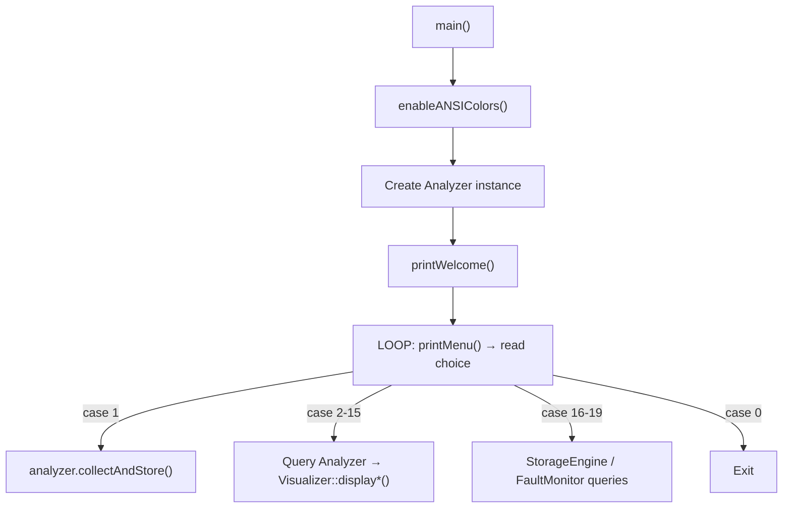
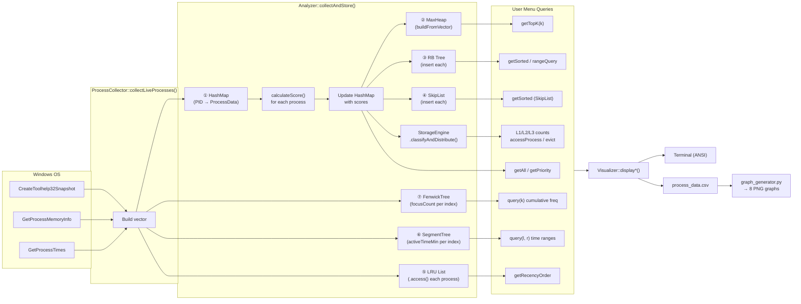
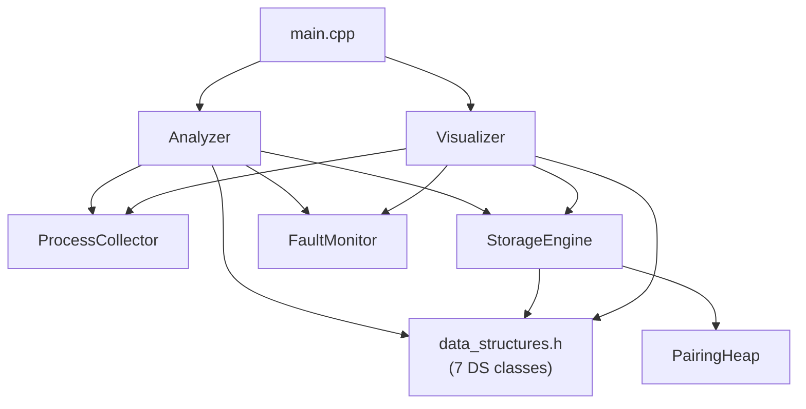

# Phase 1 — Complete Codebase Analysis

> [!NOTE]
> Every finding below was derived by reading all 8 source files in the repository. Nothing is assumed.

---

## 1. File Inventory

| File | Type | Lines | Role |
|---|---|---|---|
| [main.cpp](file:///d:/College/Semester4/DS-II/Code2_DS_3/Code2_DS/main.cpp) | C++ Source | 311 | **Entry point** — menu loop, orchestrates everything |
| [data_structures.h](file:///d:/College/Semester4/DS-II/Code2_DS_3/Code2_DS/data_structures.h) | C++ Header | 570 | Core data structure implementations (7 structures) |
| [process_collector.h](file:///d:/College/Semester4/DS-II/Code2_DS_3/Code2_DS/process_collector.h) | C++ Header | 138 | Windows API process collection |
| [analyzer.h](file:///d:/College/Semester4/DS-II/Code2_DS_3/Code2_DS/analyzer.h) | C++ Header | 312 | Score calculation, classification, query API |
| [storage_engine.h](file:///d:/College/Semester4/DS-II/Code2_DS_3/Code2_DS/storage_engine.h) | C++ Header | 422 | 3-tier storage simulation + Pairing Heap (8th DS) |
| [fault_monitor.h](file:///d:/College/Semester4/DS-II/Code2_DS_3/Code2_DS/fault_monitor.h) | C++ Header | 111 | OS page-fault analysis (statistics, correlation) |
| [visualizer.h](file:///d:/College/Semester4/DS-II/Code2_DS_3/Code2_DS/visualizer.h) | C++ Header | 758 | CLI output: tables, bars, menus (ANSI colors) |
| [graph_generator.py](file:///d:/College/Semester4/DS-II/Code2_DS_3/Code2_DS/graph_generator.py) | Python | 293 | Reads `process_data.csv`, produces 8 matplotlib graphs |

---

## 2. Entry Point — `main.cpp`



- The **`Analyzer`** object is the single god-object that owns *all* data structures.
- The `main()` function acts as a thin controller: it reads user input, calls `Analyzer` methods, and pipes results into static `Visualizer` functions.
- **No multi-threading** — everything is synchronous and blocking.

---

## 3. Major Classes & Their Responsibilities

### 3.1 `ProcessData` (struct, [data_structures.h:21-48](file:///d:/College/Semester4/DS-II/Code2_DS_3/Code2_DS/data_structures.h#L21-L48))
The universal data record. Every data structure stores copies of this struct.

| Field | Source |
|---|---|
| `name`, `pid` | Windows `PROCESSENTRY32` |
| `memoryMB`, `cpuPercent` | `GetProcessMemoryInfo()` / `GetProcessTimes()` |
| `activeTimeMin`, `startTime` | Computed from creation FILETIME |
| `lastUsedTime`, `focusCount`, `foregroundDur`, `backgroundDur` | **Simulated** (random) |
| `hotnessScore`, `classification` | Computed by `Analyzer::calculateScore()` |
| `pageFaultCount`, `peakWorkingSetKB`, `pagefileUsageKB` | `PROCESS_MEMORY_COUNTERS` |
| `storageLayer` | Set by `StorageEngine` |

### 3.2 Seven Core Data Structures ([data_structures.h](file:///d:/College/Semester4/DS-II/Code2_DS_3/Code2_DS/data_structures.h))

| # | Class | Underlying Impl | Key Operations Used |
|---|---|---|---|
| 1 | `ProcessHashMap` | `unordered_map<int, ProcessData>` | `insert`, `find`, `getAll`, `getMap` |
| 2 | `MaxHeap` | `vector<ProcessData>` + manual heapify | `buildFromVector`, `getTopK`, `extractMax` |
| 3 | `RBTreeRanking` | `map<double, vector<ProcessData>, greater>` | `insert`, `getSorted`, `rangeQuery`, `topK` |
| 4 | `SkipList` | Custom linked nodes, 16 levels | `insert`, `getSorted`, `topK` |
| 5 | `LRUList` | Doubly-linked list + `unordered_map<int, Node*>` | `access` (move-to-front), `getRecencyOrder` |
| 6 | `SegmentTree` | `vector<double>`, recursive build | `build(arr)`, `query(l,r)`, `update(idx, val)` |
| 7 | `FenwickTree` | `vector<int>` (BIT) | `init`, `update`, `query`, `rangeQuery` |

### 3.3 `PairingHeap` ([storage_engine.h:24-119](file:///d:/College/Semester4/DS-II/Code2_DS_3/Code2_DS/storage_engine.h#L24-L119))
**8th data structure** — a template pairing heap used internally by `StorageEngine` for efficient eviction (find-min of L1 cache).

### 3.4 `Analyzer` ([analyzer.h](file:///d:/College/Semester4/DS-II/Code2_DS_3/Code2_DS/analyzer.h))
The **orchestrator**. Public members expose all 7 data structures + StorageEngine + FaultMonitor.

Key methods:
- **`collectAndStore()`** — the master pipeline (see §4 below)
- **`calculateScore()`** — weighted formula: `0.20×Freq + 0.25×Recency + 0.20×Active + 0.15×Mem + 0.20×CPU`
- **Query methods**: `getAllProcesses()`, `getTopK(k)`, `getSortedRBTree()`, `getSortedSkipList()`, `getRecencyOrder()`, `getClassified()`, `getMemoryWaste()`, `getRecommendations()`, `getTimeRangeUsage()`, `getCumulativeFrequency()`, `getScoreRange()`
- **Storage**: `simulateAccess()`, `getFaultSummaries()`, `getTopFaulters()`, `getFaultCorrelation()`

### 3.5 `ProcessCollector` ([process_collector.h](file:///d:/College/Semester4/DS-II/Code2_DS_3/Code2_DS/process_collector.h))
Static class. Single method:
- **`collectLiveProcesses()`** — snapshots all Windows processes via `CreateToolhelp32Snapshot`, collects memory info (`GetProcessMemoryInfo`), timing (`GetProcessTimes`), and page faults. Aggregates duplicate process names.

### 3.6 `StorageEngine` ([storage_engine.h:144-419](file:///d:/College/Semester4/DS-II/Code2_DS_3/Code2_DS/storage_engine.h#L144-L419))
Simulates 3-tier memory hierarchy:
- **L1 Cache (HOT)**: `unordered_map<int, ProcessData>` — top 10% by score
- **L2 RAM (WARM)**: `map<double, vector<ProcessData>, greater>` (RB-tree) — middle 40%
- **L3 Disk (COLD)**: `vector<ProcessData>` — remaining 50%
- **Pairing Heap** for eviction candidates (min-score at top)
- Tracks `MovementEvent` log (promotion/demotion history, capped at 200)
- Cache hit/miss statistics

### 3.7 `FaultMonitor` ([fault_monitor.h](file:///d:/College/Semester4/DS-II/Code2_DS_3/Code2_DS/fault_monitor.h))
Static class. Pure analysis functions:
- `analyzeByClassification()` → groups faults by HOT/WARM/COLD
- `getTopFaulters()` → top N by page fault count
- `faultScoreCorrelation()` → Pearson correlation coefficient
- `getMostSwapped()` → top N by pagefile usage

### 3.8 `Visualizer` ([visualizer.h](file:///d:/College/Semester4/DS-II/Code2_DS_3/Code2_DS/visualizer.h))
Static class. 19 display functions mapping 1:1 to menu options. All output goes to `cout` with ANSI escape codes. Also writes CSV via `generateGraphData()`.

---

## 4. Data Flow — The Complete Pipeline



### Detailed sequence of `collectAndStore()` ([analyzer.h:47-121](file:///d:/College/Semester4/DS-II/Code2_DS_3/Code2_DS/analyzer.h#L47-L121)):

1. **Clear** all 7 data structures + storage engine
2. **Collect** live processes → `vector<ProcessData>`
3. **Build index mapping** (`pidToIndex`, `indexToPid`)
4. **Initialize Fenwick Tree** with process count, update with `focusCount`
5. **Build Segment Tree** from `activeTimeMin` values
6. **For each process**: calculate weighted hotness score → classify (HOT≥70, WARM≥40, COLD<40) → insert into HashMap → access in LRU List
7. **Re-read** all from HashMap → build MaxHeap, RB Tree, SkipList
8. **StorageEngine**: sort by score, distribute top 10% → L1, next 40% → L2, rest → L3
9. **Sync** layer labels back into HashMap

---

## 5. Scoring Formula

```
Score = 0.20 × normalize(focusCount)
      + 0.25 × recencyDecay(lastUsedTime)      // 100 - (secSinceUsed / 36), clamped [0, 100]
      + 0.20 × normalize(activeTimeMin)
      + 0.15 × normalize(memoryMB)
      + 0.20 × min(cpuPercent × 5, 100)
```

All normalization is relative to the current batch maximum (min-max scaling to [0, 100]).

---

## 6. Which Components Should Connect to the Qt UI

| Backend Component | What to expose in UI | UI Widget Type |
|---|---|---|
| `Analyzer::collectAndStore()` | "Refresh" button → trigger collection | QPushButton + QTimer |
| `Analyzer::getAllProcesses()` | Main process table | QTableWidget / QTableView |
| `Analyzer::getClassified()` | HOT/WARM/COLD panels with color badges | QWidget cards + QLabel |
| `Analyzer::getTopK()` | Top-K ranking list | QListWidget |
| `Analyzer::getMemoryWaste()` | Memory waste table | QTableWidget |
| `Analyzer::getRecommendations()` | Keep/Deprioritize split panels | Two QListWidgets |
| `Analyzer.maxHeap` | **Heap visualization** (tree drawing) | QGraphicsView |
| `Analyzer.rbTree` | **RB Tree visualization** (sorted nodes) | QGraphicsView |
| `Analyzer.skipList` | **Skip List visualization** (multi-level links) | QGraphicsView |
| `Analyzer.lruList` | **LRU visualization** (linked list chain) | QGraphicsView |
| `Analyzer.segTree` | Quartile analysis display | QLabel / chart |
| `Analyzer.fenwickTree` | Cumulative frequency bar | QProgressBar |
| `StorageEngine` | 3-tier capacity bars + process lists | QProgressBar + QListWidget |
| `FaultMonitor` | Fault summary table + correlation | QTableWidget + QLabel |
| `StorageEngine::movementLog` | Movement event log feed | QTableWidget (auto-scroll) |
| `StorageEngine::accessProcess()` | "Simulate Access" button + PID input | QPushButton + QSpinBox |

---

## 7. Key Architectural Observations

> [!IMPORTANT]
> **All data structures store full *copies* of `ProcessData`.** After `collectAndStore()`, the data is immutable until the next refresh. The only mutation path is `simulateAccess()` which only affects `StorageEngine` internals.

> [!WARNING]
> **`focusCount` and `lastUsedTime` are randomly simulated** ([process_collector.h:94-96](file:///d:/College/Semester4/DS-II/Code2_DS_3/Code2_DS/process_collector.h#L94-L96)). These values change on every refresh. The UI should note this.

> [!TIP]
> The existing `Analyzer` class already provides a clean query API for every view. The Qt UI can wrap `Analyzer` directly — no backend refactoring required for Phase 3.

### Coupling Map


The **Visualizer** is purely presentational (100% `cout` output). In the Qt UI, it will be *completely replaced* — none of its code needs to be reused. The **Analyzer** and everything below it can be used as-is.

---

## Phase 1 Complete ✓

**Stopping here as instructed.** Confirm to proceed to Phase 2 (UI Architecture Design).
